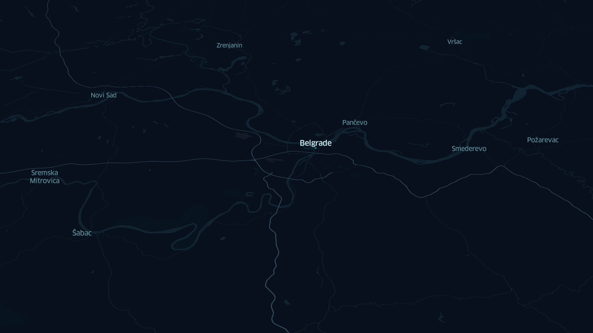

# City Mapper: Map Your Locations

A small script that takes city names as input and returns an interactive map saved to an HTML file.

## Description

I wanted to visualize the cities I've visited in Serbia. Here's an example of what the output looks like:



The map is created using Python and the [Keplergl](https://github.com/keplergl) library for visualization, and [Geopy](https://geopy.readthedocs.io/) for geocoding the city names.

## Features

- Accepts multiple city names as input.
- Uses the `Keplergl` library to generate an interactive map.
- Marks the locations of the entered cities.
- Outputs an HTML file (`cities_map_kepler.html`) that you can open in any browser.

## Installation

Clone this repository:
   ```bash
   git clone https://github.com/TalkoDenis/cities_on_the_map_var2.git

   
   cd cities_on_the_map_var2
